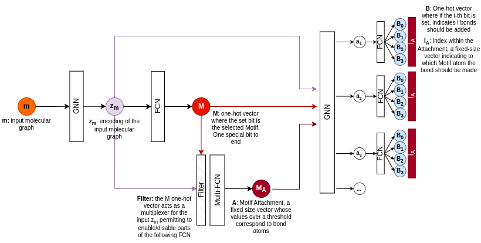

# Building the vocabulary

The Motif vocabulary is built using HierVAE code (also described in their paper).

Differently from them, we start from ZINC dataset, downloaded from TDCommons
(https://tdcommons.ai/generation_tasks/molgen/).

# Architecture

Atom features (shape: (5,)):
- Atomic number
- Explicit valence
- Formal charge
- Isotope
- Mass

Bond features (shape: (1,)):
- Bond type: ZERO, SINGLE, DOUBLE, TRIPLE, ...

# Loss function

The loss function is split into two different parts: on one hand we have to optimize the molecule score, on the other
hand we have to make sure all the chemical constraints and choices in the Motif-Attachment-Bond selection are valid.

Our approach is very similar to Microsoft's MoLeR: we also split the generation in three steps (i.e. PickMotif,
PickAttachment and PickBond); but differently from them, we try to embed everything in one differentiable policy
function.

**Chemical improvement score**: To optimize the policy function towards the improvement of a specific chemical property, we rely on Proximal Policy
Optimization (https://arxiv.org/abs/1707.06347).

**Format score**: After inference on the policy function, the result is a tuple (M, M_A, B, I_A). We expect the format of such data to be
valid (e.g. M is a one-hot vector, B is a one-hot vector, ...). Given the complexity, such validity won't
be fully accomplished, but it's something we have to optimize in the policy function.

**Invalid configuration score**: (M, M_A, B, I_A) could be an invalid configuration, or an chemically invalid configuration. Scoring 0 in such situations
would lead to a flat search-space (impossible to optimize). We need therefore a way to score "how bad" is the chosen
configuration.

### Format score

While training, we need to make sure that:

- **Motif is a one-hot vector** (i.e. a [0, 1] distribution with one "high" peak). This constraint tells the model we
  want to select one motif at a time.
- **Bond is a one-hot vector** per input molecule atom. Has 4 cells: 0 bonds (atom ignored), 1 bond, 2 bonds, 3 bonds.
  Only one of these cells is expected to have a high value.
- **Attachment index (I_A) is a one-hot vector**.

Lots of hard constraints! 

